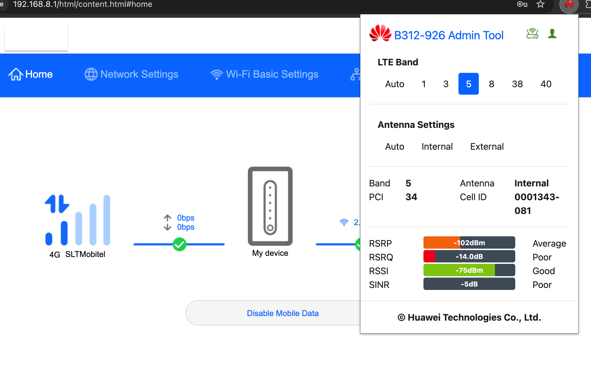

#  B312-926 Admin Tool

Huawei B312-926 admin features managing Chrome Extension.

## Screenshot

## Features
- Band lock (Auto, 1, 3, 5, 8, 38, 40)
- Signal indicators (RSRP, RSRQ, RSSI, SINR)
- Antenna modes (Internal, External)
- Manifest V3 compatible

## Installation
1. Download the latest release 
2. Open chrome://extensions
3. Enable Developer Mode
4. Load unpacked folder

Huawei is a trademark of Huawei Technologies Co., Ltd.
This project is not affiliated with or endorsed by Huawei.
